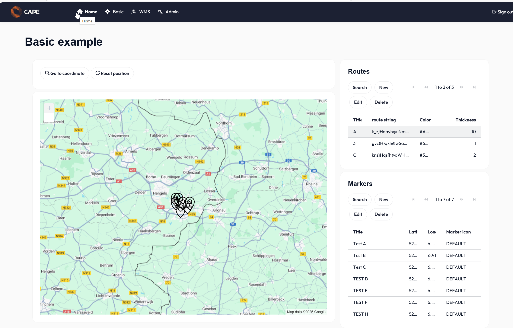

# GeoViewer Widget for Mendix

GeoViewer is a comprehensive mapping widget for Mendix applications that enables powerful geospatial visualization capabilities.

## Start guide

👉 [GeoViewer documentation](https://capegroep.github.io/GeoViewer-documentation/)

### Core Mapping Features:

Standard tile-based map rendering with multiple basemap options
Fully customizable markers with support for custom icons, colors, and sizing
Line and route visualization for displaying paths, boundaries, and connections
Intuitive zoom and pan controls for seamless navigation, legends

### Enterprise GIS Integration:

Web Map Service (WMS) compatibility for incorporating dynamic map layers
Web Feature Service (WFS) support for fetching and displaying vector features
Configurable layer management with opacity and visibility controls

### Interactive Capabilities:

Rich marker event handling for click, hover, and selection interactions
Popup information windows for detailed feature data display
Custom event triggers for integrating map actions with your application logic

GeoViewer seamlessly bridges the gap between simple mapping needs and complex GIS requirements, making it an ideal solution for applications requiring location-based visualization and interaction in the Mendix ecosystem.