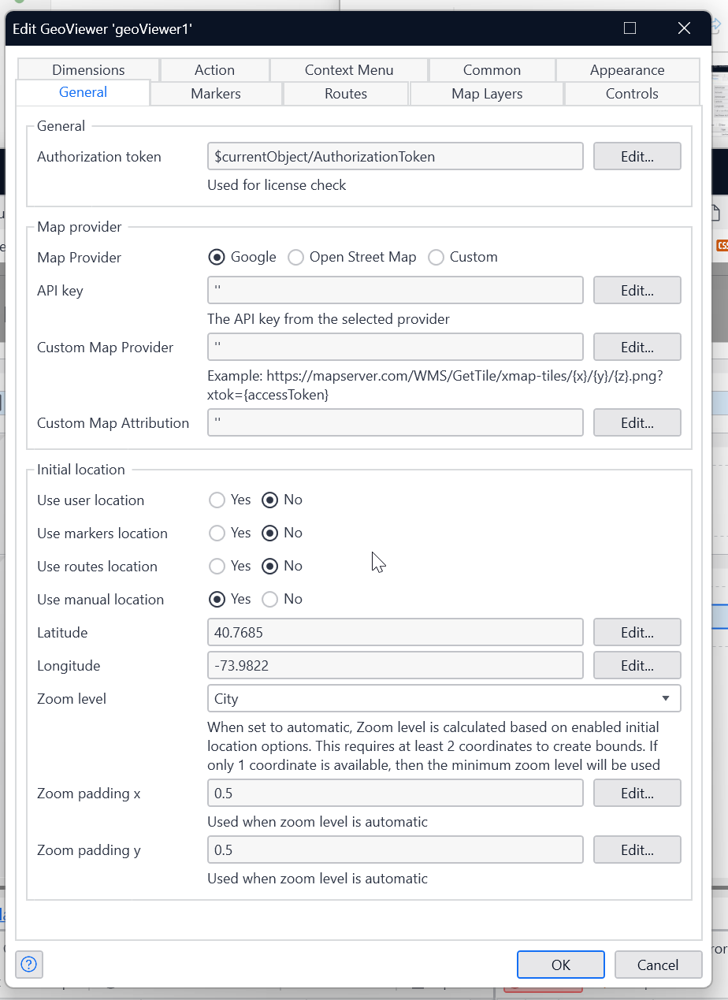

# GeoViewer Widget Implementation Guide for Mendix

## Introduction
The GeoViewer widget allows you to integrate interactive map functionality into your Mendix applications. This guide will walk you through the installation, configuration, and advanced features of the widget.

## Table of Contents
1. [Prerequisites](#prerequisites)
2. [Installation](#installation)
3. [Basic Configuration](#basic-configuration)
4. [Working with Markers](#working-with-markers)
5. [Working with Routes](#working-with-routes)
6. [WMS Layer Integration](#wms-layer-integration)
7. [Map Controls](#map-controls)
8. [Handling User Interactions](#handling-user-interactions)
9. [Advanced Features](#advanced-features)

## Prerequisites

Before implementing the GeoViewer widget, ensure you have:

- A valid license key (contact CAPE Groep at info@capegroep.nl)
- Without a license, you'll be operating in demo mode with the following limitations:
  - The widget will only function in localhost environments

## Installation

1. Navigate to the `USE_ME` folder in your Mendix module
2. Add `Microflows/ASU_GeoViewer` to your project's AfterStartup Microflow
3. Implement `Snippet/Microflows/SNIP_Configuration` on a page for license key configuration
4. Set up the necessary access rights for the module
5. Copy the `MOVE_ME` folder to a separate customization module
6. Configure access rights for the new module
7. Create a new page with `MOVE_ME/Microflows/DS_GeoViewer` as its data source
8. Add the widget to your page

## Basic Configuration

### General Settings

| Setting | Description |
|---------|-------------|
| Authorization Token | Link to the `AuthorizationToken` attribute from the `GeoViewer` entity |
| Map Provider | Select your preferred map provider (use "custom" for providers like PTV or Mapbox) |
| API Key | The API key for your tile server |
| Custom Map Provider | Endpoint URL for custom tile servers (must follow standard tile server API) |
| Custom Attribution | Custom attribution text for the map |

### Initial Location Settings

Configure how the map initially positions itself:

- **Use user location**: Uses the browser-detected location (requires user permission)
- **Use markers location**: Centers the map to display all markers
- **Use routes location**: Centers the map to display all routes
- **Use manual location**: Uses specified coordinates:
  - Latitude: The manual latitude value
  - Longitude: The manual longitude value

### Zoom Configuration

- **Zoom level**: Set to "automatic" to fit all elements or specify a fixed level
- **Zoom padding X/Y**: Adds padding around the edges when using automatic zoom

## Working with Markers

Markers represent specific points on your map.

### Marker Settings

- **Use location marker**: Displays the user's current location on the map
- **Marker data source**: Entity that provides marker data (use the provided entity or your own)
- **Title**: The display name of the marker
- **Latitude/Longitude**: Coordinates for the marker's position
- **MarkerIcon**: References an icon defined in the MarkerIcons section

### Icon Configuration

- **Icon name**: Unique identifier for the icon
- **Image**: Mendix resource path to the icon image
- **Width**: Display width of the icon in pixels

## Working with Routes

Routes display paths between points on your map.

### Route Settings

- **Routes datasource**: Entity containing route information
- **Title**: Display name for the route
- **Route color**: Hexadecimal color code for the route line
- **Route thickness**: Width of the route line in pixels
- **Route string**: Polyline encoded format string (see [polyline utility](https://developers.google.com/maps/documentation/utilities/polylineutility))

## WMS Layer Integration

To enhance your maps with Web Map Service (WMS) layers:

### WMS Components

- **Map Credentials**: Stores authentication information for WMS/WFS services
- **WMS Service**: Contains the URL for WMS tile services (e.g., `https://ows.terrestris.de/osm/service`)
- **WFS Service** (optional): Provides clickable marker functionality
- **Map Legend**: Contains the URL for legend tiles
- **Map Layer**: Combines WMS and WFS services

For filtered layers, consider using [CQL Filters](https://docs.geoserver.org/2.24.x/en/user/tutorials/cql/cql_tutorial.html).

## Map Controls

Configure how users can interact with the map:

- **Drag**: Enables/disables map panning
- **Scroll to zoom**: Enables/disables zoom via mouse wheel
- **Attribution control**: Shows/hides attribution information
- **Zoom**: Displays zoom in/out buttons
- **Min/Max zoom level**: Sets boundaries for zoom functionality

### Zoom Level Guide
- 1: World view
- 5: Continental view
- 10: City view
- 15: Street view
- 20: Building view

## Widget Dimensions

Configure the physical size of the widget:
- **Width**: Set as percentage of parent container or absolute pixels
- **Height**: Set as percentage of width or absolute pixels

## Handling User Interactions

User interactions with the map trigger the `Action_Router` nanoflow, providing:
- **Latitude/Longitude**: The coordinates where the user clicked
- **Action Type**: Typically "CLICK"
- **Action ID**: For context menu items, contains the "Event Key"

### Context Menu

Create custom right-click or left-click menus for the map, markers, or routes:
- Each menu item requires a unique Event Key
- When clicked, triggers the Action_Router with the Event Key as the Action ID

## Advanced Features

Additional functionality is available through the provided domain models and configurations. Refer to the `MOVE_ME` folder for examples and implementation templates.

## Troubleshooting

### Common Issues

- **Map not displaying**: Verify your API key and check network connections
- **Markers not appearing**: Ensure latitude/longitude values are valid
- **Route display issues**: Validate your polyline encoded string format
- **WMS layers not loading**: Check WMS server availability and authentication

### License Issues

If experiencing license-related issues:
- Verify you've correctly implemented the `SNIP_Configuration` snippet
- Ensure the license key is properly entered
- Contact CAPE Groep for license validation

## Best Practices

- Use meaningful names for markers and routes
- Keep your marker icons consistent in size and style
- Test your maps at different zoom levels
- Implement proper error handling in your Action_Router nanoflow